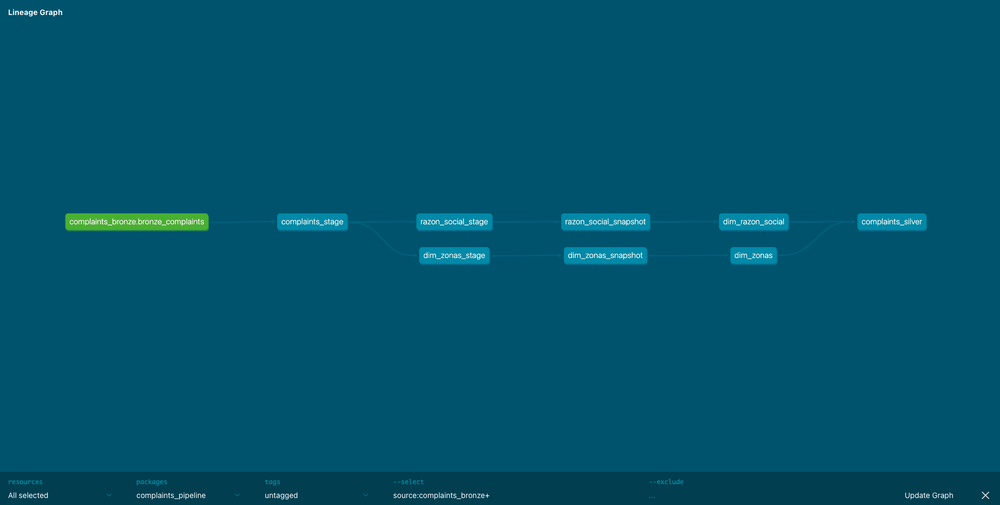
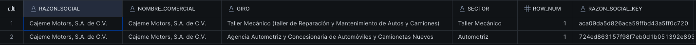
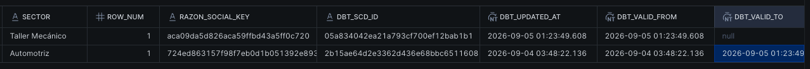
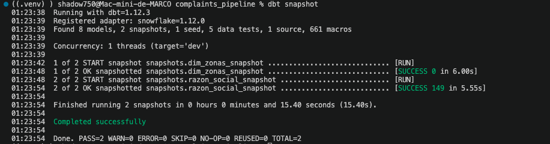

# Consumer complaints against commercial businesses. ELT using python, airflow, Amazon S3, dbt and snowflake.

This project was designed to create an end-to-end data engineering pipeline using the consumer complaints dataset from the national open data platform, hosted by the mexican government (PROFECO).

The phases of the project are the following ones:

Extraction: Using python (requests) to get the data from the URL.
Storage: Use Amazon S3 as storage destination.
Warehousing: Use Snowflake as Data Warehouse.
Transformation: Use DBT models to tranform data, modeling and ensure unit and generic tests.
Orchestration: Use Airflow to orchestrate the process (use the built in astronomer-cosmos infra).

Transformation logic:
As primary transformation logic I used a **medallion schema** based on three layer: bronze layer, silver layer and gold layer.
This means that as data go through these layers it transform into a more suitable format depending on the needs, number of teams working with this data and so on.
Also, this indicates a well defined responsibilities among these layers.
Important to say that even though dbt is a good tool for incremental loadings, due to the challenges regarding the natural key and inmutable records of the data, an alternative choosing was to use a full refreshed as stated in the **{{config(materialized='table')}}** of the silver layer main table.

## Working directory

```

├── Dockerfile
├── README.md
├── airflow_settings.yaml
├── app.log
├── dags
│   ├── __pycache__
│   ├── complaints_pipeline
│   ├── dbt_dag.py
│   ├── elt_dag.py
│   └── logs
├── docs
│   └── infrastructure
├── image.png
├── include
│   └── complaints_data.csv
├── logs
│   └── dbt.log
├── packages.txt
├── plugins
├── requirements.txt
├── src
│   ├── __init__.py
│   ├── __pycache__
│   ├── data_cleaning.py
│   ├── data_extraction.py
│   ├── upload_to_s3.py
│   └── upload_to_snowflake.py
├── tests
│   └── dags
└── utils
    ├── __init__.py
    ├── __pycache__
    ├── formats.py
    ├── snowflake_connector.py
    └── utils.py

```

## Lineage of this project

As you can see below, the project incorporates a well defined medallion architecture making the project ready for BI consumption.




## SCD TYPE 2

One of the common approaches in designing a DWH is kimball with scd type 2.
For this purpose I implemented an scd type 2 using dbt (of course). Heres some screenshots of the proper implementation.



As you can see above, Cajeme motors changed their business description (giro) as well as their sector.

As a result of this, when running a subsecuent **dbt snapshot** this creates a new row with the changes.






## How to use this project

**First steps**
1. Be sure you have docker installed and running, as well as astronomer cli (in macOS is usually runned as **brew install astro**)
2. Donwload the repo using git clone.
3. Initialize an astromer cosmos project with **astro dev run**
2. Download the dependencies using dbt deps. If you are using a .venv pls consider running **python3 -m pip install -r requirements.txt** or simply pip install -r requirements if working with older python versions.
3. Create your profiles.yml at home/user/.dbt/profiles.yml usign the following structure:
4. You are good to go.

**S3 integration with snowflake**

To create the storage integration with snowflake:

1. Create a new policy in AWS with the following permissions:

{
    "Version": "2012-10-17",
    "Statement": [
        {
            "Sid": "Statement1",
            "Effect": "Allow",
            "Action": [
                "s3:GetObject",
                "s3:GetObjectVersion",
                "s3:ListBucket",
                "s3:GetBucketLocation"
            ],
            "Resource": "your arn bucket"
        }
    ]
}

2. Create a role in AWS to which the policie will be attached to.

3. Create the storage integration in snowflake with the following settings:

CREATE OR REPLACE STORAGE INTEGRATION your_integration_name
  TYPE = EXTERNAL_STAGE
  STORAGE_PROVIDER = 'S3'
  ENABLED = TRUE
  STORAGE_AWS_ROLE_ARN = 'your_arn_role'
  STORAGE_ALLOWED_LOCATIONS = ( 'your-bucket-name') ---- structure: s3://bucket-name/

4. Once the integration has been created, execute the DESC INTEGRATION 'your_integration_name' to visualize the integration settings and from which you are going to need:
- STORAGE_AWS_IAM_USER_ARN
- STORAGE_AWS_EXTERNAL_ID

5. Change the trust relationships of your role with the following settings:

{
    "Version": "2012-10-17",
    "Statement": [
        {
            "Effect": "Allow",
            "Principal": {
                "AWS": "your-snowflake-iam-user-arn"
            },
            "Action": "sts:AssumeRole",
            "Condition": {
                "StringEquals": {
                    "sts:ExternalId": "your-aws-external-id"
                }
            }
        }
    ]
}


6. Finally, create the external stage using your integration storage and:


CREATE OR REPLACE STAGE your_external_stage_name
  STORAGE_INTEGRATION = my-integration-name
  URL = 'your-s3-bucket/' 
  FILE_FORMAT = (TYPE = 'CSV' FIELD_DELIMITER = ',' SKIP_HEADER = 1);

7. A good practice is to confirm the stage has been succesfully linked with LIST @your_external_stage_name;


**Airflow Setup**
Remember to setup the connections to external resources once you have airflow running. 
The providers used for this project were of course **apache-airflow-providers-amazon** and **apache-airflow-providers-slack**.
Notice that not snowflake provider is defined, this is because I did not implemented deferrable tasks , but its a best practice to use a designed operator for this kind of tasks and of course to use a deferrable task so no worker is blocked. In other words, I used the default snowflake connector (not the hook) and pass the arguments as system variables.
Also, notice we are using airflow taskFlow API as part of the airflow 2.0 version which I think is more sraight forward and easy to understand.

**Improvement areas**
As you can see there are multiple ways to enhaced this pipeline.
Extraction phase:
First, extraction begins and ends in a local enviroment (recreating a cloud instance), but considering the workload and improvement in a cloud enviroment, it is better to run a serverless function like lambda.
Storage phase:
Like in any other object storage, there are many ways to more efficiently save this dataset (eg. like domain, underlying source or datetime). For this approach, a year-month-day mixed with a undelying source can be a more succesfull way to sotre the objects.
Warehousing:
When imported into snowflake Im bassically using a snowflake connector for python that uses a COPY command. Other options like EXTERNAL TABLES were considered for this workload, but ever since these are more designed for read only queries and have a lower performance, I opted to use COPY command.
Transformation:
By doing a quick exploration in the dbt pipeline you can realize how simple it was to transform the data. Thats because the workload was thought as an incremental loading at first, but getting more deep into the data I realised there was not a natural key prepared for proccessing, compromising deduplication. In this scenario, I defined a load_timestamp (fecha_actualizacion) as base to use a both backfilling and overwrite strategies. Eg. If any change in past days are present, the process is really simple: delete the date(s) partition and re-execute the models.


